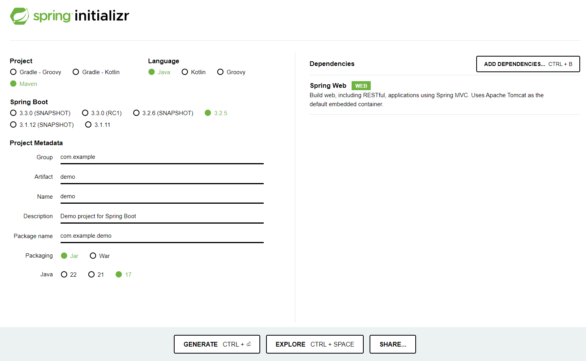
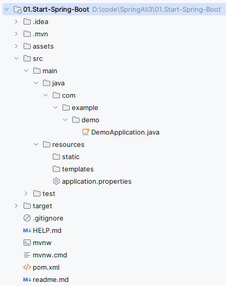
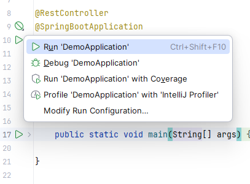
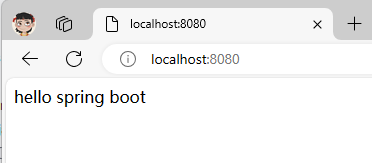
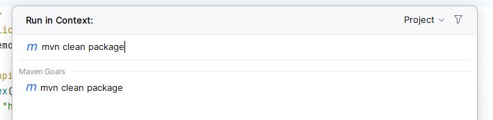
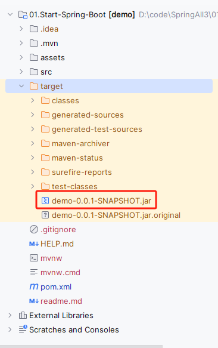
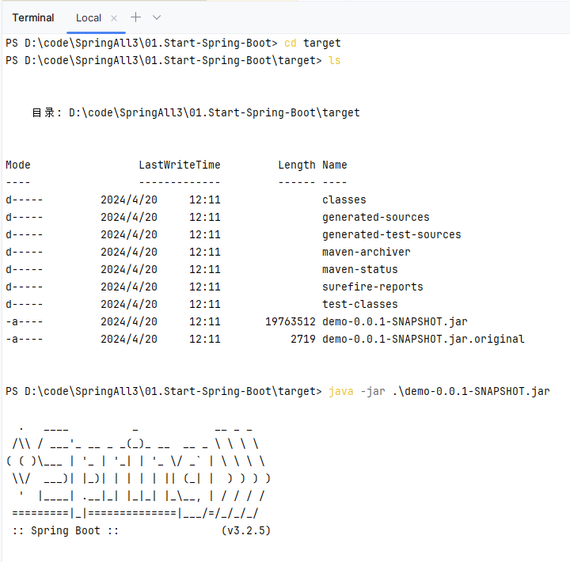

# 开启Spring Boot

## 生成项目文件

Spring Boot是在Spring框架上创建的一个全新的框架，其设计目的是简化Spring应用的搭建和开发过程。开启Spring Boot有许多种方法可供选择，这里仅介绍使用http://start.spring.io/来构建一个简单的Spring Boot项目。这里选择以Maven构建，语言选择Java，Spring Boot版本为3.2.5，以jar包的方式部署，Java版本为17。在页面的右边还可以选择诸多的依赖，这里仅选择web进行演示：



最后点击页面的GENERATE按钮生成项目文件。文件下载后是一个压缩包，进行解压然后使用IDEA以Maven项目的形式导入。导入后IDEA会自动编译项目并下载相应的依赖，项目目录如下所示：



## 简单演示

项目根目录下生成了一个artifactId+Application命名规则的入口类，为了演示简单，不再新建控制器，直接在入口类中编写代码：

```java
package com.example.demo;

import org.springframework.boot.SpringApplication;
import org.springframework.boot.autoconfigure.SpringBootApplication;
import org.springframework.web.bind.annotation.RequestMapping;
import org.springframework.web.bind.annotation.RestController;

@RestController
@SpringBootApplication
public class DemoApplication {

	@RequestMapping("/")
	String index(){
		return "hello spring boot";
	}

	public static void main(String[] args) {
		SpringApplication.run(DemoApplication.class, args);
	}

}
```

然后点击类名左边运行按钮



访问http://localhost:8080，页面显示如下：



## 打包发布

在IDEA中双击Ctrl，输入mvn clean package如下图所示：



打包完毕后可看到项目目录target文件夹下生成了一个jar文件：



生成jar包后，cd到target目录下，执行以下命令：



访问[http://localhost:8080](http://localhost:8080/)，效果如上。

## 聊聊pom.xml

打开pom.xml可看到配置如下：

```xml
<?xml version="1.0" encoding="UTF-8"?>
<project xmlns="http://maven.apache.org/POM/4.0.0" xmlns:xsi="http://www.w3.org/2001/XMLSchema-instance"
	xsi:schemaLocation="http://maven.apache.org/POM/4.0.0 https://maven.apache.org/xsd/maven-4.0.0.xsd">
	<modelVersion>4.0.0</modelVersion>
	<parent>
		<groupId>org.springframework.boot</groupId>
		<artifactId>spring-boot-starter-parent</artifactId>
		<version>3.2.5</version>
		<relativePath/> <!-- lookup parent from repository -->
	</parent>
	<groupId>com.example</groupId>
	<artifactId>demo</artifactId>
	<version>0.0.1-SNAPSHOT</version>
	<name>demo</name>
	<description>Demo project for Spring Boot</description>
	<properties>
		<java.version>17</java.version>
	</properties>
	<dependencies>
		<dependency>
			<groupId>org.springframework.boot</groupId>
			<artifactId>spring-boot-starter-web</artifactId>
		</dependency>

		<dependency>
			<groupId>org.springframework.boot</groupId>
			<artifactId>spring-boot-starter-test</artifactId>
			<scope>test</scope>
		</dependency>
	</dependencies>

	<build>
		<plugins>
			<plugin>
				<groupId>org.springframework.boot</groupId>
				<artifactId>spring-boot-maven-plugin</artifactId>
			</plugin>
		</plugins>
	</build>
</project>
```

### spring-boot-starter-parent

spring-boot-starter-parent指定了当前项目为一个Spring Boot项目，它提供了诸多的默认Maven依赖，具体可查看目录.m2\repository\org\springframework\boot\spring-boot-dependencies\3.2.5\下的spring-boot-dependencies-3.2.5.pom文件，这里仅截取一小部分：

```xml
<properties>
    <spring-amqp.version>3.1.4</spring-amqp.version>
    <spring-authorization-server.version>1.2.4</spring-authorization-server.version>
    <spring-batch.version>5.1.1</spring-batch.version>
    <spring-data-bom.version>2023.1.5</spring-data-bom.version>
    <spring-framework.version>6.1.6</spring-framework.version>
    <spring-graphql.version>1.2.6</spring-graphql.version>
    <spring-hateoas.version>2.2.2</spring-hateoas.version>
    <spring-integration.version>6.2.4</spring-integration.version>
    <spring-kafka.version>3.1.4</spring-kafka.version>
    <spring-ldap.version>3.2.3</spring-ldap.version>
    <spring-pulsar.version>1.0.5</spring-pulsar.version>
    <spring-restdocs.version>3.0.1</spring-restdocs.version>
    <spring-retry.version>2.0.5</spring-retry.version>
    <spring-security.version>6.2.4</spring-security.version>
    <spring-session.version>3.2.2</spring-session.version>
    <spring-ws.version>4.0.10</spring-ws.version>
    <thymeleaf.version>3.1.2.RELEASE</thymeleaf.version>
    <thymeleaf-extras-data-attribute.version>2.0.1</thymeleaf-extras-data-attribute.version>
    <thymeleaf-extras-springsecurity.version>3.1.2.RELEASE</thymeleaf-extras-springsecurity.version>
    <thymeleaf-layout-dialect.version>3.3.0</thymeleaf-layout-dialect.version>
  </properties>
```

需要说明的是，并非所有在`<properties>`标签中配置了版本号的依赖都有被启用，其启用与否取决于您是否配置了相应的starter。比如tomcat这个依赖就是spring-boot-starter-web的传递性依赖（下面将会描述到）。

当然，我们可以手动改变这些依赖的版本。比如我想把thymeleaf的版本改为3.0.0.RELEASE，我们可以在pom.xml中进行如下配置：

```xml
<properties>
   <thymeleaf.version>3.0.0.RELEASE</thymeleaf.version>
</properties>
```

### spring-boot-starter-web

Spring Boot提供了许多开箱即用的依赖模块，这些模块都是以spring-boot-starter-XX命名的。比如要开启Spring Boot的web功能，只需要在pom.xml中配置spring-boot-starter-web即可：

```xml
<dependency>
   <groupId>org.springframework.boot</groupId>
   <artifactId>spring-boot-starter-web</artifactId>
</dependency>
```

因为其依赖于spring-boot-starter-parent，所以这里可以不用配置version。保存后Maven会自动帮我们下载spring-boot-starter-web模块所包含的jar文件。如果需要具体查看spring-boot-starter-web包含了哪些依赖，我们可以双击Ctrl输入命令`mvn dependency:tree`，即可在控制台查看到如下信息：

```
[INFO] +- org.springframework.boot:spring-boot-starter-web:jar:3.2.5:compile
[INFO] |  +- org.springframework.boot:spring-boot-starter:jar:3.2.5:compile
[INFO] |  |  +- org.springframework.boot:spring-boot:jar:3.2.5:compile
[INFO] |  |  +- org.springframework.boot:spring-boot-autoconfigure:jar:3.2.5:compile
[INFO] |  |  +- org.springframework.boot:spring-boot-starter-logging:jar:3.2.5:compile
[INFO] |  |  |  +- ch.qos.logback:logback-classic:jar:1.4.14:compile
[INFO] |  |  |  |  \- ch.qos.logback:logback-core:jar:1.4.14:compile
[INFO] |  |  |  +- org.apache.logging.log4j:log4j-to-slf4j:jar:2.21.1:compile
[INFO] |  |  |  |  \- org.apache.logging.log4j:log4j-api:jar:2.21.1:compile
[INFO] |  |  |  \- org.slf4j:jul-to-slf4j:jar:2.0.13:compile
[INFO] |  |  +- jakarta.annotation:jakarta.annotation-api:jar:2.1.1:compile
[INFO] |  |  \- org.yaml:snakeyaml:jar:2.2:compile
[INFO] |  +- org.springframework.boot:spring-boot-starter-json:jar:3.2.5:compile
[INFO] |  |  +- com.fasterxml.jackson.core:jackson-databind:jar:2.15.4:compile
[INFO] |  |  |  +- com.fasterxml.jackson.core:jackson-annotations:jar:2.15.4:compile
[INFO] |  |  |  \- com.fasterxml.jackson.core:jackson-core:jar:2.15.4:compile
[INFO] |  |  +- com.fasterxml.jackson.datatype:jackson-datatype-jdk8:jar:2.15.4:compile
[INFO] |  |  +- com.fasterxml.jackson.datatype:jackson-datatype-jsr310:jar:2.15.4:compile
[INFO] |  |  \- com.fasterxml.jackson.module:jackson-module-parameter-names:jar:2.15.4:compile
[INFO] |  +- org.springframework.boot:spring-boot-starter-tomcat:jar:3.2.5:compile
[INFO] |  |  +- org.apache.tomcat.embed:tomcat-embed-core:jar:10.1.20:compile
[INFO] |  |  +- org.apache.tomcat.embed:tomcat-embed-el:jar:10.1.20:compile
[INFO] |  |  \- org.apache.tomcat.embed:tomcat-embed-websocket:jar:10.1.20:compile
[INFO] |  +- org.springframework:spring-web:jar:6.1.6:compile
[INFO] |  |  +- org.springframework:spring-beans:jar:6.1.6:compile
[INFO] |  |  \- io.micrometer:micrometer-observation:jar:1.12.5:compile
[INFO] |  |     \- io.micrometer:micrometer-commons:jar:1.12.5:compile
[INFO] |  \- org.springframework:spring-webmvc:jar:6.1.6:compile
[INFO] |     +- org.springframework:spring-aop:jar:6.1.6:compile
[INFO] |     +- org.springframework:spring-context:jar:6.1.6:compile
[INFO] |     \- org.springframework:spring-expression:jar:6.1.6:compile
[INFO] \- org.springframework.boot:spring-boot-starter-test:jar:3.2.5:test
[INFO]    +- org.springframework.boot:spring-boot-test:jar:3.2.5:test
[INFO]    +- org.springframework.boot:spring-boot-test-autoconfigure:jar:3.2.5:test
[INFO]    +- com.jayway.jsonpath:json-path:jar:2.9.0:test
[INFO]    |  \- org.slf4j:slf4j-api:jar:2.0.13:compile
[INFO]    +- jakarta.xml.bind:jakarta.xml.bind-api:jar:4.0.2:test
[INFO]    |  \- jakarta.activation:jakarta.activation-api:jar:2.1.3:test
[INFO]    +- net.minidev:json-smart:jar:2.5.1:test
[INFO]    |  \- net.minidev:accessors-smart:jar:2.5.1:test
[INFO]    |     \- org.ow2.asm:asm:jar:9.6:test
[INFO]    +- org.assertj:assertj-core:jar:3.24.2:test
[INFO]    |  \- net.bytebuddy:byte-buddy:jar:1.14.13:test
[INFO]    +- org.awaitility:awaitility:jar:4.2.1:test
[INFO]    +- org.hamcrest:hamcrest:jar:2.2:test
[INFO]    +- org.junit.jupiter:junit-jupiter:jar:5.10.2:test
[INFO]    |  +- org.junit.jupiter:junit-jupiter-api:jar:5.10.2:test
[INFO]    |  |  +- org.opentest4j:opentest4j:jar:1.3.0:test
[INFO]    |  |  +- org.junit.platform:junit-platform-commons:jar:1.10.2:test
[INFO]    |  |  \- org.apiguardian:apiguardian-api:jar:1.1.2:test
[INFO]    |  +- org.junit.jupiter:junit-jupiter-params:jar:5.10.2:test
[INFO]    |  \- org.junit.jupiter:junit-jupiter-engine:jar:5.10.2:test
[INFO]    |     \- org.junit.platform:junit-platform-engine:jar:1.10.2:test
[INFO]    +- org.mockito:mockito-core:jar:5.7.0:test
[INFO]    |  +- net.bytebuddy:byte-buddy-agent:jar:1.14.13:test
[INFO]    |  \- org.objenesis:objenesis:jar:3.3:test
[INFO]    +- org.mockito:mockito-junit-jupiter:jar:5.7.0:test
[INFO]    +- org.skyscreamer:jsonassert:jar:1.5.1:test
[INFO]    |  \- com.vaadin.external.google:android-json:jar:0.0.20131108.vaadin1:test
[INFO]    +- org.springframework:spring-core:jar:6.1.6:compile
[INFO]    |  \- org.springframework:spring-jcl:jar:6.1.6:compile
[INFO]    +- org.springframework:spring-test:jar:6.1.6:test
[INFO]    \- org.xmlunit:xmlunit-core:jar:2.9.1:test
```

上述这些依赖都是隐式依赖于spring-boot-starter-web，我们也可以手动排除一些我们不需要的依赖。

比如spring-boot-starter-web默认集成了tomcat，假如我们想把它换为jetty，可以在pom.xml中spring-boot-starter-web下排除tomcat依赖，然后手动引入jetty依赖：

```xml
<dependencies>
    <dependency>
        <groupId>org.springframework.boot</groupId>
        <artifactId>spring-boot-starter-web</artifactId>
        <exclusions>
            <exclusion>
                <groupId>org.springframework.boot</groupId>
                <artifactId>spring-boot-starter-tomcat</artifactId>
            </exclusion>
        </exclusions>
    </dependency>
    
    <dependency>
        <groupId>org.springframework.boot</groupId>
        <artifactId>spring-boot-starter-jetty</artifactId>
    </dependency>
</dependencies>
```

tips：依赖的坐标可以到上述的spring-boot-dependencies-3.2.5.pom文件里查找。再次运行`mvn dependency:tree`：

```
[INFO] +- org.springframework.boot:spring-boot-starter-jetty:jar:3.2.5:compile
[INFO] |  +- jakarta.servlet:jakarta.servlet-api:jar:6.0.0:compile
[INFO] |  +- jakarta.websocket:jakarta.websocket-api:jar:2.1.1:compile
[INFO] |  +- jakarta.websocket:jakarta.websocket-client-api:jar:2.1.1:compile
[INFO] |  +- org.apache.tomcat.embed:tomcat-embed-el:jar:10.1.20:compile
[INFO] |  +- org.eclipse.jetty.ee10:jetty-ee10-servlets:jar:12.0.8:compile
[INFO] |  |  +- org.eclipse.jetty:jetty-http:jar:12.0.8:compile
[INFO] |  |  +- org.eclipse.jetty:jetty-io:jar:12.0.8:compile
[INFO] |  |  +- org.eclipse.jetty:jetty-util:jar:12.0.8:compile
[INFO] |  |  \- org.slf4j:slf4j-api:jar:2.0.13:compile
[INFO] |  +- org.eclipse.jetty.ee10:jetty-ee10-webapp:jar:12.0.8:compile
[INFO] |  |  +- org.eclipse.jetty:jetty-session:jar:12.0.8:compile
[INFO] |  |  |  \- org.eclipse.jetty:jetty-server:jar:12.0.8:compile
[INFO] |  |  +- org.eclipse.jetty:jetty-xml:jar:12.0.8:compile
[INFO] |  |  \- org.eclipse.jetty.ee10:jetty-ee10-servlet:jar:12.0.8:compile
[INFO] |  |     \- org.eclipse.jetty:jetty-security:jar:12.0.8:compile
[INFO] |  +- org.eclipse.jetty.ee10.websocket:jetty-ee10-websocket-jakarta-server:jar:12.0.8:compile
[INFO] |  |  +- org.eclipse.jetty.ee10:jetty-ee10-annotations:jar:12.0.8:compile
[INFO] |  |  |  +- org.eclipse.jetty.ee10:jetty-ee10-plus:jar:12.0.8:compile
[INFO] |  |  |  |  +- jakarta.enterprise:jakarta.enterprise.cdi-api:jar:4.0.1:compile
[INFO] |  |  |  |  |  \- jakarta.inject:jakarta.inject-api:jar:2.0.1:compile
[INFO] |  |  |  |  +- jakarta.enterprise:jakarta.enterprise.lang-model:jar:4.0.1:compile
[INFO] |  |  |  |  +- jakarta.interceptor:jakarta.interceptor-api:jar:2.1.0:compile
[INFO] |  |  |  |  +- jakarta.transaction:jakarta.transaction-api:jar:2.0.1:compile
[INFO] |  |  |  |  +- org.eclipse.jetty:jetty-jndi:jar:12.0.8:compile
[INFO] |  |  |  |  \- org.eclipse.jetty:jetty-plus:jar:12.0.8:compile
[INFO] |  |  |  +- org.ow2.asm:asm:jar:9.7:compile
[INFO] |  |  |  \- org.ow2.asm:asm-commons:jar:9.7:compile
[INFO] |  |  |     \- org.ow2.asm:asm-tree:jar:9.7:compile
[INFO] |  |  +- org.eclipse.jetty.ee10.websocket:jetty-ee10-websocket-jakarta-client:jar:12.0.8:compile
[INFO] |  |  |  +- org.eclipse.jetty:jetty-client:jar:12.0.8:compile
[INFO] |  |  |  |  \- org.eclipse.jetty:jetty-alpn-client:jar:12.0.8:compile
[INFO] |  |  |  +- org.eclipse.jetty.ee10.websocket:jetty-ee10-websocket-jakarta-common:jar:12.0.8:compile
[INFO] |  |  |  \- org.eclipse.jetty.websocket:jetty-websocket-core-client:jar:12.0.8:compile
[INFO] |  |  \- org.eclipse.jetty.ee10.websocket:jetty-ee10-websocket-servlet:jar:12.0.8:compile
[INFO] |  |     \- org.eclipse.jetty.websocket:jetty-websocket-core-server:jar:12.0.8:compile
[INFO] |  \- org.eclipse.jetty.ee10.websocket:jetty-ee10-websocket-jetty-server:jar:12.0.8:compile
[INFO] |     +- org.eclipse.jetty.websocket:jetty-websocket-jetty-api:jar:12.0.8:compile
[INFO] |     \- org.eclipse.jetty.websocket:jetty-websocket-jetty-common:jar:12.0.8:compile
[INFO] |        \- org.eclipse.jetty.websocket:jetty-websocket-core-common:jar:12.0.8:compile
```

可看到tomcat已被替换为了jetty。

### spring-boot-maven-plugin

spring-boot-maven-plugin为Spring Boot Maven插件，提供了：

1. 把项目打包成一个可执行的超级JAR（uber-JAR）,包括把应用程序的所有依赖打入JAR文件内，并为JAR添加一个描述文件，其中的内容能让你用`java -jar`来运行应用程序。
2. 搜索`public static void main()`方法来标记为可运行类。