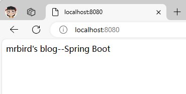

# Spring Boot一些基础配置

## 定制Banner

Spring Boot项目在启动的时候会有一个默认的启动图案：

```
  .   ____          _            __ _ _
 /\\ / ___'_ __ _ _(_)_ __  __ _ \ \ \ \
( ( )\___ | '_ | '_| | '_ \/ _` | \ \ \ \
 \\/  ___)| |_)| | | | | || (_| |  ) ) ) )
  '  |____| .__|_| |_|_| |_\__, | / / / /
 =========|_|==============|___/=/_/_/_/
 :: Spring Boot ::                (v3.2.5)
```

我们可以把这个图案修改为自己想要的。在src/main/resources目录下新建banner.txt文件，然后将自己的图案黏贴进去即可。ASCII图案可通过网站http://www.network-science.de/ascii/一键生成，比如输入mrbird生成图案后复制到banner.txt，启动项目，IDEA控制台输出如下：

```
             ___.   .__           .___
  ___________\_ |__ |__|______  __| _/
 /     \_  __ \ __ \|  \_  __ \/ __ |
|  Y Y  \  | \/ \_\ \  ||  | \/ /_/ |
|__|_|  /__|  |___  /__||__|  \____ |
      \/          \/               \/ 
...
2024-04-20T15:28:06.781+08:00  INFO 29732 --- [demo] [           main] w.s.c.ServletWebServerApplicationContext : Root WebApplicationContext: initialization completed in 1076 ms
2024-04-20T15:28:07.198+08:00  INFO 29732 --- [demo] [           main] o.s.b.w.embedded.tomcat.TomcatWebServer  : Tomcat started on port 8080 (http) with context path ''
2024-04-20T15:28:07.207+08:00  INFO 29732 --- [demo] [           main] com.example.demo.DemoApplication         : Started DemoApplication in 2.095 seconds (process running for 2.894)

```

banner也可以关闭，在main方法中：

```java
public static void main(String[] args) {
	SpringApplication app = new SpringApplication(DemoApplication.class);
	app.setBannerMode(Banner.Mode.OFF);
	app.run(args);
}
```

## 全局配置文件

在src/main/resources目录下，Spring Boot提供了一个名为application.properties的全局配置文件，可对一些默认配置的配置值进行修改。

> 附：[application.properties中可配置所有官方属性](https://docs.spring.io/spring-boot/docs/current/reference/html/common-application-properties.html)

### 自定义属性值

Spring Boot允许我们在application.properties下自定义一些属性，比如：

```
mrbird.blog.name=mrbird's blog
mrbird.blog.title=Spring Boot
```

定义一个BlogProperties Bean，通过`@Value("${属性名}")`来加载配置文件中的属性值：

```
@Data
@Component
public class BlogProperties {	
    @Value("${mrbird.blog.name}")
    private String name;
    
    @Value("${mrbird.blog.title}")
    private String title;
}
```

编写IndexController，注入该Bean：

```
@RestController
public class IndexController {
    @Autowired
    private BlogProperties blogProperties;
    
    @RequestMapping("/")
    String index() {
        return blogProperties.getName()+"——"+blogProperties.getTitle();
    }
}
```

启动项目，访问[http://localhost:8080](http://localhost:8080/)，页面显示如下：



在属性非常多的情况下，也可以定义一个和配置文件对应的Bean：

```java
@Data
@Component
@ConfigurationProperties(prefix = "mrbird.blog")
public class BlogProperties {
    private String name;
    private String title;
}
```

通过注解`@ConfigurationProperties(prefix="mrbird.blog")`指明了属性的通用前缀，通用前缀加属性名和配置文件的属性名一一对应。

### 属性间的引用

在application.properties配置文件中，各个属性可以相互引用，如下：

```
mrbird.blog.name=mrbird's blog
mrbird.blog.title=Spring Boot
mrbird.blog.wholeTitle=${mrbird.blog.name}--${mrbird.blog.title}
```

## 自定义配置文件

除了可以在application.properties里配置属性，我们还可以自定义一个配置文件。在src/main/resources目录下新建一个test.properties:

```
test.name=KangKang
test.age=25
```

定义一个对应该配置文件的Bean：

```
@Data
@Component
@ConfigurationProperties(prefix = "test")
@PropertySource("classpath:test.properties")
public class TestProperties {
    private String name;
    private int age;
}
```

注解`@PropertySource("classpath:test.properties")`指明了使用哪个配置文件。

##  通过命令行设置属性值

在运行Spring Boot jar文件时，可以使用命令`java -jar xxx.jar --server.port=8081`来改变端口的值。这条命令等价于我们手动到application.properties中修改（如果没有这条属性的话就添加）server.port属性的值为8081。

如果不想项目的配置被命令行修改，可以在入口文件的main方法中进行如下设置：

```java
public static void main(String[] args) {
    SpringApplication app = new SpringApplication(Application.class);
    app.setAddCommandLineProperties(false);
    app.run(args);
}
```

## 使用xml配置

虽然Spring Boot并不推荐我们继续使用xml配置，但如果出现不得不使用xml配置的情况，Spring Boot允许我们在入口类里通过注解`@ImportResource({"classpath:some-application.xml"})`来引入xml配置文件。

## Profile配置

Profile用来针对不同的环境下使用不同的配置文件，多环境配置文件必须以`application-{profile}.properties`的格式命，其中`{profile}`为环境标识。比如定义两个配置文件：

- application-dev.properties：开发环境

  ```
  server.port=8080
  ```

- application-prod.properties：生产环境

  ```
  server.port=8081
  ```

至于哪个具体的配置文件会被加载，需要在application.properties文件中通过`spring.profiles.active`属性来设置，其值对应`{profile}`值。

如：`spring.profiles.active=dev`就会加载application-dev.properties配置文件内容。可以在运行jar文件的时候使用命令`java -jar xxx.jar --spring.profiles.active={profile}`切换不同的环境配置。