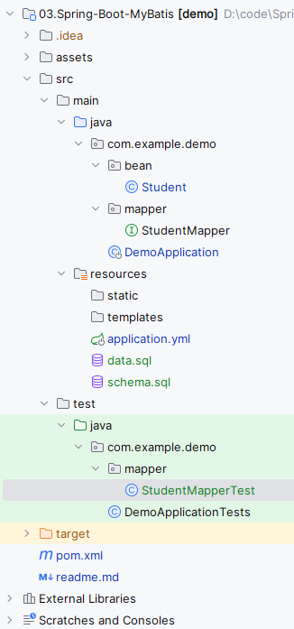

## Spring Boot中使用MyBatis

整合MyBatis之前，先搭建一个基本的Spring Boot项目[开启Spring Boot](https://mrbird.cc/开启Spring-Boot.html)。然后引入`mybatis-spring-boot-starter`和数据库连接驱动。

## mybatis-spring-boot-starter

在 [pom.xml](pom.xml) 中引入：

```
<dependency>
    <groupId>org.mybatis.spring.boot</groupId>
    <artifactId>mybatis-spring-boot-starter</artifactId>
    <version>3.0.3</version>
</dependency>
```

不同版本的Spring Boot和MyBatis版本对应不一样，具体可查看官方文档：http://www.mybatis.org/spring-boot-starter/mybatis-spring-boot-autoconfigure/。

通过`dependency:tree`命令查看`mybatis-spring-boot-starter`都有哪些隐性依赖：

```
[INFO] \- org.mybatis.spring.boot:mybatis-spring-boot-starter:jar:3.0.2:compile
[INFO]    +- org.springframework.boot:spring-boot-starter-jdbc:jar:3.2.5:compile
[INFO]    |  +- com.zaxxer:HikariCP:jar:5.0.1:compile
[INFO]    |  \- org.springframework:spring-jdbc:jar:6.1.6:compile
[INFO]    |     \- org.springframework:spring-tx:jar:6.1.6:compile
[INFO]    +- org.mybatis.spring.boot:mybatis-spring-boot-autoconfigure:jar:3.0.2:compile
[INFO]    +- org.mybatis:mybatis:jar:3.5.13:compile
[INFO]    \- org.mybatis:mybatis-spring:jar:3.0.2:compile
```

可发现其包含了`spring-boot-starter-jdbc`依赖，默认使用HikariCP数据源。

##  引入h2数据库驱动

在 [pom.xml](pom.xml) 中引入：

```
<dependency>
    <groupId>com.h2database</groupId>
    <artifactId>h2</artifactId>
</dependency>
```

## 配置数据源

 [application.yml](src\main\resources\application.yml)  添加数据源配置

```yml
spring:
  datasource:
    url: jdbc:h2:mem:testdb
    username: sa
    password:
    driverClassName: org.h2.Driver
  sql:
    init:
      schema-locations: classpath:schema.sql
      data-locations: classpath:data.sql
```

 [schema.sql](src\main\resources\schema.sql)  建表语句

```sql
CREATE TABLE IF NOT EXISTS student
(
    sno   VARCHAR(255) PRIMARY KEY,
    sname VARCHAR(255) NOT NULL,
    ssex  CHAR(1)      NOT NULL
);
```

 [data.sql](src\main\resources\data.sql)  示例数据

```sql
insert into student values ('001', 'KangKang', 'M');
insert into student values ('002', 'Mike', 'M');
insert into student values ('003', 'Jane', 'F');
```


## 使用MyBatis

创建对应实体 [Student.java](src\main\java\com\example\demo\bean\Student.java) ：

```java
@Data
public class Student{
    private String sno;
    private String name;
    private String sex;
}
```

创建一个包含基本CRUD的 [StudentMapper.java](src\main\java\com\example\demo\mapper\StudentMapper.java) ：

```java
@Component
@Mapper
public interface StudentMapper {
    @Insert("insert into student(sno,sname,ssex) values(#{sno},#{name},#{sex})")
    int add(Student student);
    
    @Update("update student set sname=#{name},ssex=#{sex} where sno=#{sno}")
    int update(Student student);
    
    @Delete("delete from student where sno=#{sno}")
    int deleteBySno(String sno);
    
    @Select("select * from student where sno=#{sno}")
    @Results(id = "student",value= {
        @Result(property = "sno", column = "sno", javaType = String.class),
        @Result(property = "name", column = "sname", javaType = String.class),
        @Result(property = "sex", column = "ssex", javaType = String.class)
    })
    Student queryBySno(String sno);
}
```

## 测试

接下来编写 [StudentMapperTest.java](src\test\java\com\example\demo\mapper\StudentMapperTest.java) ：

```java
@SpringBootTest
@ExtendWith(SpringExtension.class)
class StudentMapperTest {
    @Autowired
    private StudentMapper studentMapper;

    @Test
    void add() {
        Student student = new Student();
        student.setSno("100");
        student.setName("tony");
        student.setSex("F");
        int i = studentMapper.add(student);
        assertEquals(1, i);
    }

    @Test
    void update() {
        Student student = new Student();
        student.setSno("101");
        student.setName("pony");
        student.setSex("M");
        studentMapper.add(student);

        student.setSex("F");
        studentMapper.update(student);
        student = studentMapper.queryBySno(student.getSno());
        assertEquals("F", student.getSex());
    }

    @Test
    void deleteBySno() {
        Student student = new Student();
        student.setSno("102");
        student.setName("john");
        student.setSex("M");
        studentMapper.add(student);

        int i = studentMapper.deleteBySno(student.getSno());
        assertEquals(1, i);
    }

    @Test
    void queryBySno() {
        Student student = new Student();
        student.setSno("104");
        student.setName("tom");
        student.setSex("F");
        studentMapper.add(student);

        student = studentMapper.queryBySno(student.getSno());
        assertNotNull(student);
        assertEquals("tom", student.getName());
        assertEquals("F", student.getSex());
    }
}
```

完整的项目目录如下图所示：


