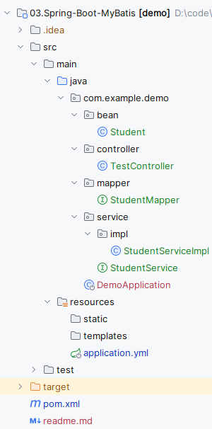
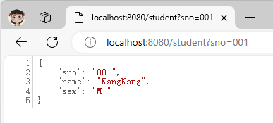

## Spring Boot中使用MyBatis

整合MyBatis之前，先搭建一个基本的Spring Boot项目[开启Spring Boot](https://mrbird.cc/开启Spring-Boot.html)。然后引入`mybatis-spring-boot-starter`和数据库连接驱动（这里使用关系型数据库Oracle 11g）。

## mybatis-spring-boot-starter

在pom中引入：

```
<dependency>
    <groupId>org.mybatis.spring.boot</groupId>
    <artifactId>mybatis-spring-boot-starter</artifactId>
</dependency>
```

不同版本的Spring Boot和MyBatis版本对应不一样，具体可查看官方文档：http://www.mybatis.org/spring-boot-starter/mybatis-spring-boot-autoconfigure/。

通过`dependency:tree`命令查看`mybatis-spring-boot-starter`都有哪些隐性依赖：

```
[INFO] \- org.mybatis.spring.boot:mybatis-spring-boot-starter:jar:3.0.2:compile
[INFO]    +- org.springframework.boot:spring-boot-starter-jdbc:jar:3.2.5:compile
[INFO]    |  +- com.zaxxer:HikariCP:jar:5.0.1:compile
[INFO]    |  \- org.springframework:spring-jdbc:jar:6.1.6:compile
[INFO]    |     \- org.springframework:spring-tx:jar:6.1.6:compile
[INFO]    +- org.mybatis.spring.boot:mybatis-spring-boot-autoconfigure:jar:3.0.2:compile
[INFO]    +- org.mybatis:mybatis:jar:3.5.13:compile
[INFO]    \- org.mybatis:mybatis-spring:jar:3.0.2:compile
```

可发现其包含了`spring-boot-starter-jdbc`依赖，默认使用HikariCP数据源。

##  引入ojdbc6

由于版权的原因，我们需要将ojdbc6.jar依赖安装到本地的maven仓库，然后才可以在pom中进行配置。

下载ojdbc6.jar文件后，将其放到比较好找的目录下，比如D盘根目录。然后运行以下命令：

```
C:\Users\Administrator>mvn install:install-file -Dfile=D:/ojdbc6.jar -DgroupId=com.oracle -DartifactId=ojdbc6 -Dversion=6.0 -
Dpackaging=jar -DgeneratePom=true

...
[INFO] --- maven-install-plugin:2.4:install-file (default-cli) @ standalone-pom ---
[INFO] Installing D:\ojdbc6.jar to D:\m2\repository\com\oracle\ojdbc6\6.0\ojdbc6-6.0.jar
[INFO] Installing C:\Users\ADMINI~1\AppData\Local\Temp\mvninstall9103688544010617483.pom to D:\m2\repository\com\oracle\ojdbc
6\6.0\ojdbc6-6.0.pom
[INFO] ------------------------------------------------------------------------
[INFO] BUILD SUCCESS
[INFO] ------------------------------------------------------------------------
[INFO] Total time: 0.940 s
[INFO] Finished at: 2017-08-13T15:06:38+08:00
[INFO] Final Memory: 6M/145M
[INFO] ------------------------------------------------------------------------
```

接着在pom中引入：

```
<dependency>
    <groupId>com.oracle</groupId>
    <artifactId>ojdbc6</artifactId>
    <version>6.0</version>
</dependency>
```

这里的groupid就是你之前安装时指定的-Dgroupid的值，artifactid就是你安装时指定的-Dartifactid的值，version也一样。

## Druid数据源

Druid是一个关系型数据库连接池，是阿里巴巴的一个开源项目，地址：https://github.com/alibaba/druid。Druid不但提供连接池的功能，还提供监控功能，可以实时查看数据库连接池和SQL查询的工作情况。

### 配置Druid依赖

Druid为Spring Boot项目提供了对应的starter：

```
<dependency>
   <groupId>com.alibaba</groupId>
   <artifactId>druid-spring-boot-starter</artifactId>
   <version>1.2.22</version>
</dependency>
```

### Druid数据源配置

上面通过查看mybatis starter的隐性依赖发现，Spring Boot的数据源配置的默认类型是`com.zaxxer.hikari.HikariDataSource`，为了使用Druid连接池，需要在application.yml下配置：

```
spring:
  datasource:
    type: com.alibaba.druid.pool.DruidDataSource
    driver-class-name: oracle.jdbc.OracleDriver
    url: jdbc:oracle:thin:@192.168.1.144:1521:XE
    username: scott
    password: 123456
```

## 使用MyBatis

使用的库表：

```sql
CREATE TABLE "SCOTT"."STUDENT" (
    "SNO" VARCHAR2(3 BYTE) NOT NULL ,
    "SNAME" VARCHAR2(9 BYTE) NOT NULL ,
    "SSEX" CHAR(2 BYTE) NOT NULL 
);

INSERT INTO "SCOTT"."STUDENT" VALUES ('001', 'KangKang', 'M ');
INSERT INTO "SCOTT"."STUDENT" VALUES ('002', 'Mike', 'M ');
INSERT INTO "SCOTT"."STUDENT" VALUES ('003', 'Jane', 'F ');
```

创建对应实体：

```java
@Data
public class Student implements Serializable{
    private static final long serialVersionUID = -339516038496531943L;
    private String sno;
    private String name;
    private String sex;
}
```

创建一个包含基本CRUD的StudentMapper：

```java
@Component
@Mapper
public interface StudentMapper {
    @Insert("insert into student(sno,sname,ssex) values(#{sno},#{name},#{sex})")
    int add(Student student);
    
    @Update("update student set sname=#{name},ssex=#{sex} where sno=#{sno}")
    int update(Student student);
    
    @Delete("delete from student where sno=#{sno}")
    int deleteBySno(String sno);
    
    @Select("select * from student where sno=#{sno}")
    @Results(id = "student",value= {
        @Result(property = "sno", column = "sno", javaType = String.class),
        @Result(property = "name", column = "sname", javaType = String.class),
        @Result(property = "sex", column = "ssex", javaType = String.class)
    })
    Student queryBySno(String sno);
}
```

## 测试

接下来编写Service：

```java
public interface StudentService {
    int add(Student student);
    int update(Student student);
    int deleteBySno(String sno);
    Student queryBySno(String sno);
}
```

实现类：

```java
@Service("studentService")
public class StudentServiceImp implements StudentService{
    @Autowired
    private StudentMapper studentMapper;
    
    @Override
    public int add(Student student) {
        return studentMapper.add(student);
    }
    
    @Override
    public int update(Student student) {
        return studentMapper.update(student);
    }
    
    @Override
    public int deleteBySno(String sno) {
        return studentMapper.deleteBySno(sno);
    }
    
    @Override
    public Student queryBySno(String sno) {
        return studentMapper.queryBySno(sno);
    }
}
```

编写controller：

```java
@RestController
public class TestController {

    @Autowired
    private StudentService studentService;
    
    @GetMapping("/student")
    public Student queryBySno(String sno) {
        return studentService.queryBySno(sno);
    }
}
```

完整的项目目录如下图所示：



启动项目访问：http://localhost:8080/student?sno=001：


