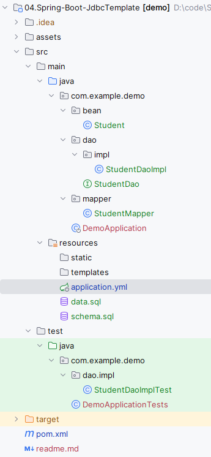

## Spring Boot中使用JdbcTemplate

个人觉得JdbcTemplate相较于MyBaits，Hibernate等数据库框架更容易上手，对SQL的操作也更为直观方便，所以在项目中也是一个不错的选择。在Spring Boot开启JdbcTemplate很简单，只需要引入`spring-boot-starter-jdbc`依赖即可。JdbcTemplate封装了许多SQL操作，具体可查阅官方文档https://docs.spring.io/spring/docs/current/javadoc-api/org/springframework/jdbc/core/JdbcTemplate.html。

## 引入依赖

数据库采用h2，使用lombok简化代码。

```xml
<dependency>
    <groupId>org.springframework.boot</groupId>
    <artifactId>spring-boot-starter-jdbc</artifactId>
</dependency>
<dependency>
    <groupId>com.h2database</groupId>
    <artifactId>h2</artifactId>
</dependency>
<dependency>
    <groupId>org.projectlombok</groupId>
    <artifactId>lombok</artifactId>
    <scope>provided</scope>
</dependency>
```

## 建表

 [schema.sql](src\main\resources\schema.sql) 建表

```sql
CREATE TABLE IF NOT EXISTS student
(
    sno   VARCHAR(255) PRIMARY KEY,
    sname VARCHAR(255) NOT NULL,
    ssex  CHAR(1)      NOT NULL
);
```

 [data.sql](src\main\resources\data.sql) 插入示例数据

```sql
insert into student values ('001', 'KangKang', 'M');
insert into student values ('002', 'Mike', 'M');
insert into student values ('003', 'Jane', 'F');
```

[application.yml](src\main\resources\application.yml) 配置文件

```yml
spring:
  datasource:
    url: jdbc:h2:mem:testdb
    username: sa
    password:
    driverClassName: org.h2.Driver
  sql:
    init:
      schema-locations: classpath:schema.sql
      data-locations: classpath:data.sql
```


## 代码编写

 [Student.java](src\main\java\com\example\demo\bean\Student.java) 使用@Data注解简化getter和setter方法。

```java
@Data
public class Student {
    private String sno;
    private String name;
    private String sex;
}
```

 [StudentMapper.java](src\main\java\com\example\demo\mapper\StudentMapper.java) 当数据库列名与Java Bean属性名不一致时，使用RowMapper进行映射。

```java
public class StudentMapper implements RowMapper<Student> {
    @Override
    public Student mapRow(ResultSet rs, int rowNum) throws SQLException {
        Student student = new Student();
        student.setSno(rs.getString("sno"));
        student.setName(rs.getString("sname"));
        student.setSex(rs.getString("ssex"));
        return student;
    }
}
```

 [StudentDao.java](src\main\java\com\example\demo\dao\StudentDao.java) 

```java
public interface StudentDao {
    int add(Student student);

    int update(Student student);

    int deleteBySno(String sno);

    List<Map<String, Object>> queryListMap();

    Student queryBySno(String sno);
}
```

 [StudentDaoImpl.java](src\main\java\com\example\demo\dao\impl\StudentDaoImpl.java) 

```java
@Repository
public class StudentDaoImpl implements StudentDao {

    @Autowired
    private NamedParameterJdbcTemplate tpl;

    @Override
    public int add(Student student) {
        String sql = "insert into student(sno, sname, ssex) values(:sno, :name, :sex)";
        return tpl.update(sql, new BeanPropertySqlParameterSource(student));
    }

    @Override
    public int update(Student student) {
        String sql = "update student set sname=:name,ssex=:sex where sno=:sno";
        return tpl.update(sql, new BeanPropertySqlParameterSource(student));
    }

    @Override
    public int deleteBySno(String sno) {
        String sql = "delete from student where sno=:sno";
        return tpl.update(sql, Map.of("sno", sno));
    }

    @Override
    public List<Map<String, Object>> queryListMap() {
        String sql = "select * from student";
        return tpl.queryForList(sql, new HashMap<>());
    }

    @Override
    public Student queryBySno(String sno) {
        String sql = "select * from student where sno=:sno";
        List<Student> studentList = tpl.query(sql, Map.of("sno", sno), new StudentMapper());
        if (studentList != null && studentList.size() > 0) return studentList.get(0);
        return null;
    }
}
```

## 测试

 [StudentDaoImplTest.java](src\test\java\com\example\demo\dao\impl\StudentDaoImplTest.java) 

```java
@SpringBootTest
@ExtendWith(SpringExtension.class)
class StudentDaoImplTest {

    @Autowired
    private StudentDao studentDao;

    @Test
    void add() {
        Student student = new Student();
        student.setSno("100");
        student.setName("tony");
        student.setSex("F");
        int i = studentDao.add(student);
        assertEquals(1, i);
    }

    @Test
    void update() {
        Student student = new Student();
        student.setSno("101");
        student.setName("pony");
        student.setSex("M");
        studentDao.add(student);

        student.setSex("F");
        studentDao.update(student);
        student = studentDao.queryBySno(student.getSno());
        assertEquals("F", student.getSex());
    }


    @Test
    void deleteBySno() {
        Student student = new Student();
        student.setSno("102");
        student.setName("john");
        student.setSex("M");
        studentDao.add(student);

        int i = studentDao.deleteBySno(student.getSno());
        assertEquals(1, i);
    }

    @Test
    void queryListMap() {
        List<Map<String, Object>> list = studentDao.queryListMap();
        assertTrue(list.size() >= 3);
    }

    @Test
    void queryBySno() {
        Student student = new Student();
        student.setSno("104");
        student.setName("tom");
        student.setSex("F");
        studentDao.add(student);

        student = studentDao.queryBySno(student.getSno());
        assertNotNull(student);
        assertEquals("tom", student.getName());
        assertEquals("F", student.getSex());
    }

}
```

最终项目目录如下图所示：

