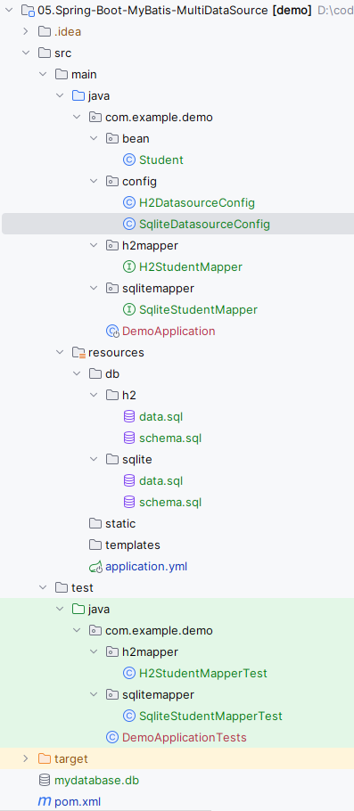

# Spring Boot MyBatis配置Druid多数据源

在Spring Boot中配置MyBatis多数据源的关键在于创建SqlSessionFactory的时候为其分配不同的数据源。

## 引入依赖

先根据[01.Start-Spring-Boot](../01.Start-Spring-Boot/readme.md)开启一个最简单的Spring Boot应用，然后引入如下依赖：

```xml
<!--sqlite数据库-->
<dependency>
    <groupId>org.xerial</groupId>
    <artifactId>sqlite-jdbc</artifactId>
    <version>3.36.0.3</version>
</dependency>
<!--h2数据库-->
<dependency>
    <groupId>com.h2database</groupId>
    <artifactId>h2</artifactId>
    <version>1.4.200</version>
</dependency>
<!--持久层框架-->
<dependency>
    <groupId>org.mybatis.spring.boot</groupId>
    <artifactId>mybatis-spring-boot-starter</artifactId>
    <version>3.0.3</version>
</dependency>
<!--数据库连接池-->
<dependency>
    <groupId>com.alibaba</groupId>
    <artifactId>druid-spring-boot-starter</artifactId>
    <version>1.2.15</version>
</dependency>
<!--简化代码-->
<dependency>
    <groupId>org.projectlombok</groupId>
    <artifactId>lombok</artifactId>
    <scope>provided</scope>
</dependency>
```

为简化环境配置，本文使用了h2和sqlite两款嵌入式数据库，无需额外配置。使用mybatis作为持久层框架，druid为数据库连接池。另外引入lombok简化代码。

## 多数据源配置

 [application.yml](src\main\resources\application.yml) 配置sqlite和h2的连接信息

```yml
spring:
  datasource:
    sqlite:
      url: 'jdbc:sqlite::memory:'
      driver-class-name: org.sqlite.JDBC
      initialization-mode: always
    h2:
      url: 'jdbc:h2:mem:testdb'
      driver-class-name: org.h2.Driver
      username: sa
      password:
      initialization-mode: always
```

 [SqliteDatasourceConfig.java](src\main\java\com\example\demo\config\SqliteDatasourceConfig.java) 使用spring.datasource.sqlite前缀配置项构建数据源，并基于此数据源构造SqlSessionFactory。使用DataSourceInitializer指定数据库初始化操作。使用@MapperScan注解配置扫描sqlitemapper包下的mapper接口，并将其注册到sqliteSqlSessionFactory。

```java
@Configuration
// 扫描sqlitemapper包下的mapper接口，并将其注册到sqliteSqlSessionFactory
@MapperScan(basePackages = "com.example.demo.sqlitemapper", sqlSessionFactoryRef = "sqliteSqlSessionFactory")
public class SqliteDatasourceConfig {
    @Bean("sqliteDataSource")
    // 使用spring.datasource.sqlite为前缀的配置项构建sqlite数据源
    @ConfigurationProperties("spring.datasource.sqlite")
    public DataSource sqliteDataSource() {
        return DruidDataSourceBuilder.create().build();
    }

    @Bean("sqliteTransactionManager")
    public DataSourceTransactionManager sqliteTransactionManager() {
        return new DataSourceTransactionManager(sqliteDataSource());
    }

    // 使用sqliteDataSource构建SqlSessionFactory
    @Bean("sqliteSqlSessionFactory")
    public SqlSessionFactory mysqlSqlSessionFactory(@Qualifier("sqliteDataSource") DataSource dataSource) throws Exception {
        final SqlSessionFactoryBean sessionFactoryBean = new SqlSessionFactoryBean();
        sessionFactoryBean.setDataSource(dataSource);
        return sessionFactoryBean.getObject();
    }

    // 指定sqlite数据源的初始化sql语句
    @Bean("sqliteInitializer")
    public DataSourceInitializer h2Initializer(@Qualifier("sqliteDataSource") DataSource sqliteDatasource) {
        DataSourceInitializer initializer = new DataSourceInitializer();
        initializer.setDataSource(sqliteDatasource);
        ResourceDatabasePopulator populator = new ResourceDatabasePopulator();
        populator.addScript(new ClassPathResource("db/sqlite/schema.sql"));
        populator.addScript(new ClassPathResource("db/sqlite/data.sql"));
        initializer.setDatabasePopulator(populator);
        return initializer;
    }
}
```

 [H2DatasourceConfig.java](src\main\java\com\example\demo\config\H2DatasourceConfig.java) 配置逻辑同sqlite

```java
@Configuration
// 扫描h2mapper包下的mapper接口，并将其注册到h2SqlSessionFactory
@MapperScan(basePackages = "com.example.demo.h2mapper", sqlSessionFactoryRef = "h2SqlSessionFactory")
public class H2DatasourceConfig {

    @Primary
    @Bean("h2DataSource")
    // 使用spring.datasource.h2为前缀的配置项构建h2数据源
    @ConfigurationProperties("spring.datasource.h2")
    public DataSource h2DataSource() {
        return DruidDataSourceBuilder.create().build();
    }

    @Primary
    @Bean("h2TransactionManager")
    public DataSourceTransactionManager h2TransactionManager() {
        return new DataSourceTransactionManager(h2DataSource());
    }

    @Primary
    // 使用h2DataSource构建SqlSessionFactory
    @Bean("h2SqlSessionFactory")
    public SqlSessionFactory mysqlSqlSessionFactory(@Qualifier("h2DataSource") DataSource dataSource) throws Exception {
        final SqlSessionFactoryBean sessionFactoryBean = new SqlSessionFactoryBean();
        sessionFactoryBean.setDataSource(dataSource);
        return sessionFactoryBean.getObject();
    }

    @Primary
    // 指定h2数据源的初始化sql语句
    @Bean("h2Initializer")
    public DataSourceInitializer h2Initializer(@Qualifier("h2DataSource") DataSource h2Datasource){
        DataSourceInitializer initializer = new DataSourceInitializer();
        initializer.setDataSource(h2Datasource);
        ResourceDatabasePopulator populator = new ResourceDatabasePopulator();
        populator.addScript(new ClassPathResource("db/h2/schema.sql"));
        populator.addScript(new ClassPathResource("db/h2/data.sql"));
        initializer.setDatabasePopulator(populator);
        return initializer;
    }
}
```

## 初始化语句和实体类

sqlite初始化语句

 [schema.sql](src\main\resources\db\h2\schema.sql) 

```sql
CREATE TABLE IF NOT EXISTS student
(
    sno   VARCHAR(255) PRIMARY KEY,
    sname VARCHAR(255) NOT NULL,
    ssex  CHAR(1)      NOT NULL
);
```

 [data.sql](src\main\resources\db\sqlite\data.sql) 

```sql
insert into student values ('101', 'Tom', 'M');
insert into student values ('102', 'Tim', 'M');
insert into student values ('103', 'Tony', 'F');
```

h2初始化语句

 [schema.sql](src\main\resources\db\h2\schema.sql) 

```sql
CREATE TABLE IF NOT EXISTS student
(
    sno   VARCHAR(255) PRIMARY KEY,
    sname VARCHAR(255) NOT NULL,
    ssex  CHAR(1)      NOT NULL
);
```

 [data.sql](src\main\resources\db\h2\data.sql) 

```sql
insert into student values ('001', 'KangKang', 'M');
insert into student values ('002', 'Mike', 'M');
insert into student values ('003', 'Jane', 'F');
```

 [Student.java](src\main\java\com\example\demo\bean\Student.java) 实体类

```java
@Data
public class Student {
    private String sno;
    private String name;
    private String sex;
}
```

## mapper接口

接下来分别在com.example.demo.sqlitemapper路径和com.example.demo.h2mapper路径下创建两个mapper接口：

 [SqliteStudentMapper.java](src\main\java\com\example\demo\sqlitemapper\SqliteStudentMapper.java) 

```java
@Mapper
public interface H2StudentMapper {
    @Select("select sno, sname as name, ssex as sex from student")
    List<Student> getAllStudents();
}
```

 [H2StudentMapper.java](src\main\java\com\example\demo\h2mapper\H2StudentMapper.java) 

```java
@Mapper
public interface H2StudentMapper {
    @Select("select sno, sname as name, ssex as sex from student")
    List<Student> getAllStudents();
}
```

## 测试

 [SqliteStudentMapperTest.java](src\test\java\com\example\demo\sqlitemapper\SqliteStudentMapperTest.java) sqlite测试类

```java
@SpringBootTest
@ExtendWith(SpringExtension.class)
class SqliteStudentMapperTest {

    @Autowired
    private SqliteStudentMapper studentMapper;

    @Test
    void getAllStudents() {
        List<Student> list = studentMapper.getAllStudents();
        for (Student student : list) {
            System.out.println(student);
        }
    }
}
```

 [H2StudentMapperTest.java](src\test\java\com\example\demo\h2mapper\H2StudentMapperTest.java) h2测试类

```sql
@SpringBootTest
@ExtendWith(SpringExtension.class)
class H2StudentMapperTest {

    @Autowired
    private H2StudentMapper studentMapper;

    @Test
    void getAllStudents() {
        List<Student> list = studentMapper.getAllStudents();
        for (Student student : list) {
            System.out.println(student);
        }
    }
}
```

最终项目目录如下图所示：

