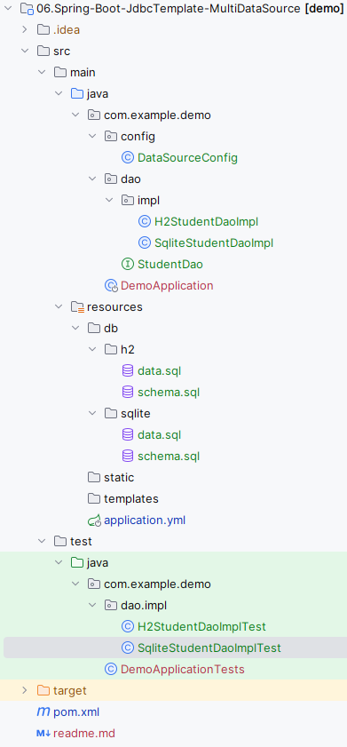

# Spring Boot JdbcTemplate配置Druid多数据源

JdbcTemplate配置Druid多数据源的核心在于创建JdbcTemplate时候为其分配不同的数据源，然后在需要访问不同数据库的时候使用对应的JdbcTemplate即可。这里介绍在Spring Boot中基于H2和Sqlite配置Druid多数据源。

## 引入依赖

先根据[01.Start-Spring-Boot](../01.Start-Spring-Boot/readme.md)开启一个最简单的Spring Boot应用，然后引入如下依赖：

 [pom.xml](pom.xml) 

```xml
<dependency>
	<groupId>org.xerial</groupId>
	<artifactId>sqlite-jdbc</artifactId>
	<version>3.36.0.3</version>
</dependency>
<!--h2数据库-->
<dependency>
	<groupId>com.h2database</groupId>
	<artifactId>h2</artifactId>
	<version>1.4.200</version>
</dependency>
<!--持久层框架-->
<dependency>
	<groupId>org.springframework.boot</groupId>
	<artifactId>spring-boot-starter-jdbc</artifactId>
</dependency>
<!--数据库连接池-->
<dependency>
	<groupId>com.alibaba</groupId>
	<artifactId>druid-spring-boot-starter</artifactId>
	<version>1.2.15</version>
</dependency>
<!--简化代码-->
<dependency>
	<groupId>org.projectlombok</groupId>
	<artifactId>lombok</artifactId>
	<scope>provided</scope>
</dependency>
```

## 多数据源配置

接着在Spring Boot配置文件application.yml中配置多数据源：

 [application.yml](src\main\resources\application.yml) 

```yml
spring:
  datasource:
    sqlite:
      url: 'jdbc:sqlite::memory:'
      driver-class-name: org.sqlite.JDBC
      initialization-mode: always
    h2:
      url: 'jdbc:h2:mem:testdb'
      driver-class-name: org.h2.Driver
      username: sa
      password:
      initialization-mode: always
```

然后创建一个多数据源配置类，根据application.yml分别配置一个H2和Sqlite的数据源，并且将这两个数据源注入到两个不同的JdbcTemplate中：

 [DataSourceConfig.java](src\main\java\com\example\demo\config\DataSourceConfig.java) 

```java
@Configuration
public class DataSourceConfig {
    @Primary
    @Bean("h2DataSource")
    @ConfigurationProperties("spring.datasource.h2")
    public DataSource h2DataSource() {
        return DruidDataSourceBuilder.create().build();
    }

    @Primary
    @Bean("h2JdbcTemplate")
    public JdbcTemplate h2JdbcTemplate(@Qualifier("h2DataSource") DataSource dataSource) {
        return new JdbcTemplate(dataSource);
    }

    @Primary
    // 指定h2数据源的初始化sql语句
    @Bean("h2Initializer")
    public DataSourceInitializer h2Initializer(@Qualifier("h2DataSource") DataSource dataSource){
        DataSourceInitializer initializer = new DataSourceInitializer();
        initializer.setDataSource(dataSource);
        ResourceDatabasePopulator populator = new ResourceDatabasePopulator();
        populator.addScript(new ClassPathResource("db/h2/schema.sql"));
        populator.addScript(new ClassPathResource("db/h2/data.sql"));
        initializer.setDatabasePopulator(populator);
        return initializer;
    }

    @Bean("sqliteDataSource")
    @ConfigurationProperties("spring.datasource.sqlite")
    public DataSource sqliteDataSource() {
        return DruidDataSourceBuilder.create().build();
    }

    @Bean("sqliteJdbcTemplate")
    public JdbcTemplate sqliteJdbcTemplate(@Qualifier("sqliteDataSource") DataSource dataSource) {
        return new JdbcTemplate(dataSource);
    }

    // 指定sqlite数据源的初始化sql语句
    @Bean("sqliteInitializer")
    public DataSourceInitializer sqliteInitializer(@Qualifier("sqliteDataSource") DataSource dataSource){
        DataSourceInitializer initializer = new DataSourceInitializer();
        initializer.setDataSource(dataSource);
        ResourceDatabasePopulator populator = new ResourceDatabasePopulator();
        populator.addScript(new ClassPathResource("db/sqlite/schema.sql"));
        populator.addScript(new ClassPathResource("db/sqlite/data.sql"));
        initializer.setDatabasePopulator(populator);
        return initializer;
    }
}
```


上述代码根据application.yml创建了h2DataSource和sqliteDataSource数据源，其中h2DataSource用`@Primary`标注为主数据源，接着根据这两个数据源创建了h2JdbcTemplate和sqliteJdbcTemplate，并使用DataSourceInitializer分别指定了初始化SQL语句。

`@Primary`标志这个Bean如果在多个同类Bean候选时，该Bean优先被考虑。多数据源配置的时候，必须要有一个主数据源，用`@Primary`标志该Bean。

数据源创建完毕，接下来开始进行测试代码编写。

## 数据

首先准备H2数据库的初始化SQL数据：

 [schema.sql](src\main\resources\db\h2\schema.sql) 

```sql
CREATE TABLE IF NOT EXISTS student
(
    sno   VARCHAR(255) PRIMARY KEY,
    sname VARCHAR(255) NOT NULL,
    ssex  CHAR(1)      NOT NULL
);
```

 [data.sql](src\main\resources\db\h2\data.sql) 

```sql
insert into student values ('001', 'KangKang', 'M');
insert into student values ('002', 'Mike', 'M');
insert into student values ('003', 'Jane', 'F');
```

再准备Sqlite数据库的初始化SQL数据：

 [schema.sql](src\main\resources\db\sqlite\schema.sql) 

```sql
CREATE TABLE IF NOT EXISTS student
(
    sno   VARCHAR(255) PRIMARY KEY,
    sname VARCHAR(255) NOT NULL,
    ssex  CHAR(1)      NOT NULL
);
```

 [data.sql](src\main\resources\db\sqlite\data.sql) 

```sql
insert into student values ('101', 'Tom', 'M');
insert into student values ('102', 'Tim', 'M');
insert into student values ('103', 'Tony', 'F');
```

## 测试

 [H2StudentDaoImplTest.java](src\test\java\com\example\demo\dao\impl\H2StudentDaoImplTest.java) 

```java
@SpringBootTest
@ExtendWith(SpringExtension.class)
class H2StudentDaoImplTest {

    @Autowired
    @Qualifier("h2StudentDao")
    private StudentDao h2StudentDao;

    @Test
    void getAllStudents() {
        List<Map<String, Object>> list = h2StudentDao.getAllStudents();
        for (Map<String, Object> map : list) {
            for (Map.Entry<String, Object> entry : map.entrySet()) {
                System.out.printf("%s:%s; ", entry.getKey(), entry.getValue());
            }
            System.out.println();
        }
    }
}
```

 [SqliteStudentDaoImplTest.java](src\test\java\com\example\demo\dao\impl\SqliteStudentDaoImplTest.java) 

```java
@SpringBootTest
@ExtendWith(SpringExtension.class)
class SqliteStudentDaoImplTest {

    @Autowired
    @Qualifier("sqliteStudentDao")
    private StudentDao sqliteStudentDao;

    @Test
    void getAllStudents() {
        List<Map<String, Object>> list = sqliteStudentDao.getAllStudents();
        for (Map<String, Object> map : list) {
            for (Map.Entry<String, Object> entry : map.entrySet()) {
                System.out.printf("%s:%s; ", entry.getKey(), entry.getValue());
            }
            System.out.println();
        }
    }
}
```

最终项目目录如下图所示：

