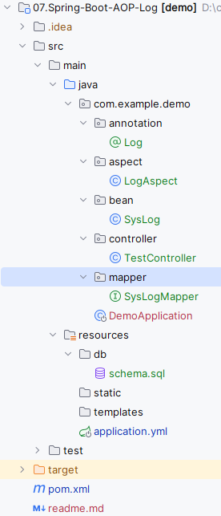
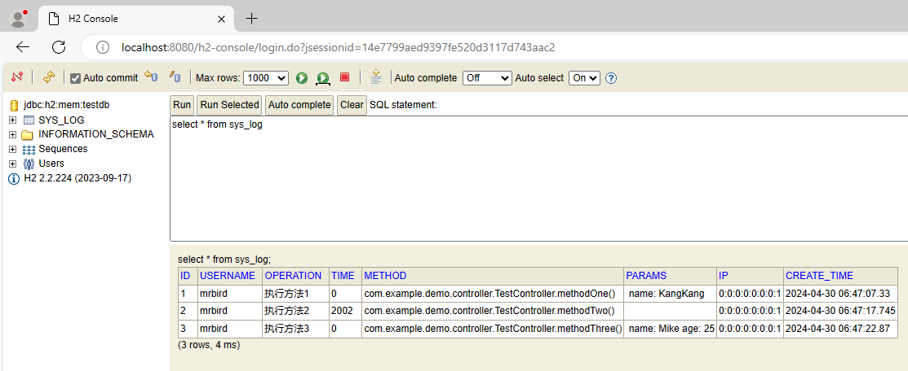

# Spring Boot AOP记录用户操作日志

在Spring框架中，使用AOP配合自定义注解可以方便的实现用户操作的监控。首先搭建一个基本的Spring Boot Web环境[01.Start-Spring-Boot](../01.Start-Spring-Boot/readme.md)，然后引入必要依赖：

 [pom.xml](pom.xml) 依赖

```xml
<dependency>
    <groupId>org.springframework.boot</groupId>
    <artifactId>spring-boot-starter-aop</artifactId>
</dependency>
<dependency>
    <groupId>org.mybatis.spring.boot</groupId>
    <artifactId>mybatis-spring-boot-starter</artifactId>
    <version>3.0.3</version>
</dependency>
<dependency>
    <groupId>com.h2database</groupId>
    <artifactId>h2</artifactId>
</dependency>
<dependency>
    <groupId>org.projectlombok</groupId>
    <artifactId>lombok</artifactId>
    <scope>provided</scope>
</dependency>
```

 [application.yml](src\main\resources\application.yml) 数据库连接信息

```yml
spring:
  datasource:
    url: jdbc:h2:mem:testdb # H2数据库，数据保存在内存中
    username: sa
    password:
    driverClassName: org.h2.Driver
  sql:
    init:
      schema-locations: classpath:db/schema.sql # 初始化SQL语句
  h2:
    console:
      enabled: true # 开启H2控制台，通过http://localhost:8080/h2-console访问
```

## 创建库表和实体

在数据库中创建一张sys_log表，用于保存用户的操作日志，数据库采用H2：

 [schema.sql](src\main\resources\db\schema.sql) 初始化语句

```sql
CREATE TABLE SYS_LOG
(
    ID          BIGINT NOT NULL,
    USERNAME    VARCHAR(50),
    OPERATION   VARCHAR(50),
    TIME        BIGINT,
    METHOD      VARCHAR(200),
    PARAMS      VARCHAR(500),
    IP          VARCHAR(64),
    CREATE_TIME TIMESTAMP
);

COMMENT ON COLUMN SYS_LOG.USERNAME IS '用户名';
COMMENT ON COLUMN SYS_LOG.OPERATION IS '用户操作';
COMMENT ON COLUMN SYS_LOG.TIME IS '响应时间';
COMMENT ON COLUMN SYS_LOG.METHOD IS '请求方法';
COMMENT ON COLUMN SYS_LOG.PARAMS IS '请求参数';
COMMENT ON COLUMN SYS_LOG.IP IS 'IP地址';
COMMENT ON COLUMN SYS_LOG.CREATE_TIME IS '创建时间';

CREATE SEQUENCE seq_sys_log START WITH 1 INCREMENT BY 1;
```

 [SysLog.java](src\main\java\com\example\demo\bean\SysLog.java) 实体类，使用@Data注解简化代码

```java
@Data
public class SysLog {
    private Integer id;
    private String username;
    private String operation;
    private Integer time;
    private String method;
    private String params;
    private String ip;
    private Date createTime;
}
```

## 保存日志的方法

 [SysLogMapper.java](src\main\java\com\example\demo\mapper\SysLogMapper.java) 使用mybatis保存数据

```java
@Mapper
public interface SysLogMapper {
    // 保存日志
    @Insert("insert into sys_log(id,username,operation,time,method,params,ip,create_time) " +
            "values(nextval('seq_sys_log'),#{username},#{operation},#{time},#{method},#{params},#{ip},#{createTime})")
    int saveSysLog(SysLog sysLog);

    // 查找所有日志
    @Select("select * from sys_log")
    List<SysLog> findSysLog();
}
```

## 自定义注解

 [Log.java](src\main\java\com\example\demo\annotation\Log.java) 定义一个方法级别的`@Log`注解，用于标注需要监控的方法：

```java
@Target(ElementType.METHOD)
@Retention(RetentionPolicy.RUNTIME)
public @interface Log {
    String value() default "";
}
```

## 切面和切点

定义一个LogAspect类，使用`@Aspect`标注让其成为一个切面，切点为使用`@Log`注解标注的方法，使用`@Around`环绕通知：

 [LogAspect.java](src\main\java\com\example\demo\aspect\LogAspect.java) 

```java
@Aspect
@Component
public class LogAspect {
    @Autowired
    private SysLogMapper sysLogMapper;

    @Pointcut("@annotation(com.example.demo.annotation.Log)")
    public void pointcut() {
    }

    @Around("pointcut()")
    public Object around(ProceedingJoinPoint point) {
        Object result = null;
        long beginTime = System.currentTimeMillis();
        try {
            // 执行方法
            result = point.proceed();
        } catch (Throwable e) {
            e.printStackTrace();
        }
        // 执行耗时（毫秒）
        long time = System.currentTimeMillis() - beginTime;
        // 保存日志
        saveLog(point, time);
        return result;
    }

    private void saveLog(ProceedingJoinPoint point, long time) {
        MethodSignature signature = (MethodSignature) point.getSignature();
        Method method = signature.getMethod();
        SysLog sysLog = new SysLog();

        Log annotation = method.getAnnotation(Log.class);
        // 注解的值
        if (annotation != null) sysLog.setOperation(annotation.value());
        // 方法名称
        String className = point.getTarget().getClass().getName();
        String methodName = signature.getName();
        sysLog.setMethod(className + "." + methodName + "()");
        // 参数值
        Object[] args = point.getArgs();
        // 参数名称
        StandardReflectionParameterNameDiscoverer discoverer = new StandardReflectionParameterNameDiscoverer();
        String[] parameterNames = discoverer.getParameterNames(method);
        if (args != null && parameterNames != null) {
            StringBuilder sb = new StringBuilder();
            for (int i = 0; i < args.length; i++) {
                sb.append(" ").append(parameterNames[i]).append(": ").append(args[i]);
            }
            sysLog.setParams(sb.toString());
        }
        // 获取request
        ServletRequestAttributes requestAttributes = (ServletRequestAttributes) RequestContextHolder.currentRequestAttributes();
        HttpServletRequest request = requestAttributes.getRequest();
        // 设置IP
        sysLog.setIp(getIpAddress(request));
        // 模拟一个用户
        sysLog.setUsername("mrbird");
        sysLog.setTime((int) time);
        sysLog.setCreateTime(new Date());
        sysLogMapper.saveSysLog(sysLog);
    }
	
    // 模拟获取用户真实IP
    public static String getIpAddress(HttpServletRequest request) {
        return "0:0:0:0:0:0:0:1";
    }
}
```

## 测试

 [TestController.java](src\main\java\com\example\demo\controller\TestController.java) 写一个controller使用@Log注解

```java
@RestController
public class TestController {
    @Log("执行方法1")
    @GetMapping("/one")
    public void methodOne(String name) {
    }

    @Log("执行方法2")
    @GetMapping("/two")
    public void methodTwo() throws InterruptedException {
        TimeUnit.SECONDS.sleep(2);
    }

    @Log("执行方法3")
    @GetMapping("/three")
    public void methodThree(String name, Integer age) {
    }
}
```

最终项目目录如下图所示：



启动项目，分别访问：

- http://localhost:8080/one?name=KangKang
- http://localhost:8080/two
- http://localhost:8080/three?name=Mike&age=25

查询数据库：

