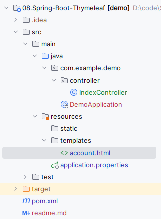
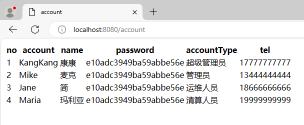

# Spring Boot中使用thymeleaf

Spring Boot支持FreeMarker、Groovy、Thymeleaf和Mustache四种模板解析引擎，官方推荐使用Thymeleaf。

## spring-boot-starter-thymeleaf

在Spring Boot中使用Thymeleaf只需在pom中加入Thymeleaf的starter即可：

```xml
<dependency>
    <groupId>org.springframework.boot</groupId>
    <artifactId>spring-boot-starter-thymeleaf</artifactId>
</dependency>
```

在Spring Boot中，默认的html页面地址为src/main/resources/templates，默认的静态资源地址为src/main/resources/static。

## 简单示例

 [IndexController.java](src\main\java\com\example\demo\controller\IndexController.java) 简单controller，添加list作为数据

```java
@Controller
public class IndexController {

    @GetMapping("/account")
    public String account(Model model) {
        List<Map<String, Object>> list = new ArrayList<>();
        list.add(Map.of("account", "KangKang", "name", "康康",
                "password", "e10adc3949ba59abbe56e", "accountType", "超级管理员", "tel", "17777777777"));
        list.add(Map.of("account", "Mike", "name", "麦克",
                "password", "e10adc3949ba59abbe56e", "accountType", "管理员", "tel", "13444444444"));
        list.add(Map.of("account", "Jane", "name", "简",
                "password", "e10adc3949ba59abbe56e", "accountType", "运维人员", "tel", "18666666666"));
        list.add(Map.of("account", "Maria", "name", "玛利亚",
                "password", "e10adc3949ba59abbe56e", "accountType", "清算人员", "tel", "19999999999"));
        model.addAttribute("accountList", list);
        return "account";
    }
}
```

 [account.html](src\main\resources\templates\account.html) 渲染controller赋值的accountList数据

```html
<!DOCTYPE html>
<html xmlns:th="http://www.thymeleaf.org">
<head>
    <title>account</title>
    <meta http-equiv="Content-Type" content="text/html; charset=UTF-8" />
</head>
<body>
<table>
    <tr>
        <th>no</th>
        <th>account</th>
        <th>name</th>
        <th>password</th>
        <th>accountType</th>
        <th>tel</th>
    </tr>
    <tr th:each="list,stat : ${accountList}">
        <td th:text="${stat.count}"></td>
        <td th:text="${list.account}"></td>
        <td th:text="${list.name}"></td>
        <td th:text="${list.password}"></td>
        <td th:text="${list.accountType}"></td>
        <td th:text="${list.tel}"></td>
    </tr>
</table>
</body>
</html>
```

最终项目目录如下所示：



启动项目，访问http://localhost:8080/account：

