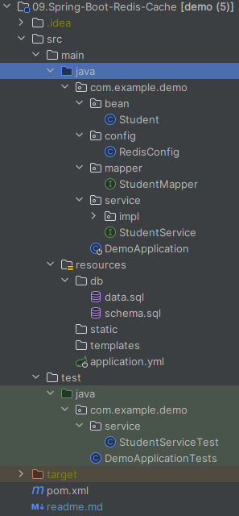

# Spring Boot中使用Redis缓存
在程序中可以使用缓存的技术来节省对数据库的开销。Spring Boot对缓存提供了很好的支持，我们几乎不用做过多的配置即可使用各种缓存实现。这里主要介绍平日里个人接触较多的Redis缓存实现。

## 准备工作
可根据[03.Spring-Boot-MyBatis](../03.Spring-Boot-MyBatis/readme.md)搭建一个Spring Boot项目，然后yml中配置日志输出级别以观察SQL的执行情况：
```yml
logging:
  level:
    com:
      example:
        demo:
          mapper: debug
```
其中`com.example.demo.mapper`为MyBatis的Mapper接口路径。

编写service接口：[StudentService.java](src%2Fmain%2Fjava%2Fcom%2Fexample%2Fdemo%2Fservice%2FStudentService.java)
```java
@Service
public interface StudentService {
    Student update(Student student);
    Student queryBySno(String sno);
}
```
编写service实现类：[StudentServiceImpl.java](src%2Fmain%2Fjava%2Fcom%2Fexample%2Fdemo%2Fservice%2Fimpl%2FStudentServiceImpl.java)
```java
@Service
public class StudentServiceImpl implements StudentService {
    @Autowired
    private StudentMapper mapper;
    @Override
    public Student update(Student student) {
        mapper.update(student);
        return mapper.queryBySno(student.getSno());
    }
    @Override
    public Student queryBySno(String sno) {
        return mapper.queryBySno(sno);
    }
}
```
然后编写如下测试方法：[StudentServiceTest.java](src%2Ftest%2Fjava%2Fcom%2Fexample%2Fdemo%2Fservice%2FStudentServiceTest.java)
```java
@SpringBootTest
@ExtendWith(SpringExtension.class)
class StudentServiceTest {
    @Autowired
    private StudentService studentService;
    @Test
    void queryBySno() {
        Student student1 = studentService.queryBySno("001");
        System.out.println(student1);

        Student student2 = studentService.queryBySno("001");
        System.out.println(student2);
    }
}
```
点击左侧运行按钮：
```
2024-05-04T21:28:02.884+08:00 DEBUG 8732 --- [           main] c.e.d.mapper.StudentMapper.queryBySno    : ==>  Preparing: select * from student where sno=?
2024-05-04T21:28:02.923+08:00 DEBUG 8732 --- [           main] c.e.d.mapper.StudentMapper.queryBySno    : ==> Parameters: 001(String)
2024-05-04T21:28:02.966+08:00 DEBUG 8732 --- [           main] c.e.d.mapper.StudentMapper.queryBySno    : <==      Total: 1
Student(sno=001, name=KangKang, sex=M)
2024-05-04T21:28:02.968+08:00 DEBUG 8732 --- [           main] c.e.d.mapper.StudentMapper.queryBySno    : ==>  Preparing: select * from student where sno=?
2024-05-04T21:28:02.969+08:00 DEBUG 8732 --- [           main] c.e.d.mapper.StudentMapper.queryBySno    : ==> Parameters: 001(String)
2024-05-04T21:28:02.969+08:00 DEBUG 8732 --- [           main] c.e.d.mapper.StudentMapper.queryBySno    : <==      Total: 1
Student(sno=001, name=KangKang, sex=M)
```
可发现第二个查询虽然和第一个查询完全一样，但其还是对数据库进行了查询。接下来引入缓存来改善这个结果。

## 使用缓存
要开启Spring Boot的缓存功能，需要在pom中引入spring-boot-starter-cache：
```xml
<dependency>
    <groupId>org.springframework.boot</groupId>
    <artifactId>spring-boot-starter-cache</artifactId>
</dependency>
```
接着在Spring Boot入口类中加入`@EnableCaching`注解开启缓存功能：
```java
@SpringBootApplication
@EnableCaching
public class DemoApplication {
    public static void main(String[] args) {
        SpringApplication.run(DemoApplication.class, args);
    }
}
```
在StudentService接口中加入缓存注解：
```java
@Service
@CacheConfig(cacheNames = "student")
public interface StudentService {
    @CachePut(key = "#p0.sno")
    Student update(Student student);

    @Cacheable(key="#p0")
    Student queryBySno(String sno);
}
```
我们在StudentService接口中加入了`@CacheConfig`注解，queryStudentBySno方法使用了注解`@Cacheable(key="#p0")`，即将id作为redis中的key值。当我们更新数据的时候，应该使用`@CachePut(key="#p0.sno")`进行缓存数据的更新，否则将查询到脏数据，因为该注解保存的是方法的返回值，所以这里应该返回Student。

在Spring Boot中可使用的缓存注解有：

### 缓存注解

1. `@CacheConfig`：主要用于配置该类中会用到的一些共用的缓存配置。在这里`@CacheConfig(cacheNames = "student")`：配置了该数据访问对象中返回的内容将存储于名为student的缓存对象中，我们也可以不使用该注解，直接通过`@Cacheable`自己配置缓存集的名字来定义；
2. `@Cacheable`：配置了queryStudentBySno函数的返回值将被加入缓存。同时在查询时，会先从缓存中获取，若不存在才再发起对数据库的访问。该注解主要有下面几个参数：
   - `value`、`cacheNames`：两个等同的参数（cacheNames为Spring 4新增，作为value的别名），用于指定缓存存储的集合名。由于Spring 4中新增了`@CacheConfig`，因此在Spring 3中原本必须有的value属性，也成为非必需项了；
   - `key`：缓存对象存储在Map集合中的key值，非必需，缺省按照函数的所有参数组合作为key值，若自己配置需使用SpEL表达式，比如：`@Cacheable(key = "#p0")`：使用函数第一个参数作为缓存的key值，更多关于SpEL表达式的详细内容可参考https://docs.spring.io/spring/docs/current/spring-framework-reference/integration.html#cache；
   - `condition`：缓存对象的条件，非必需，也需使用SpEL表达式，只有满足表达式条件的内容才会被缓存，比如：`@Cacheable(key = "#p0", condition = "#p0.length() < 3")`，表示只有当第一个参数的长度小于3的时候才会被缓存；
   - `unless`：另外一个缓存条件参数，非必需，需使用SpEL表达式。它不同于condition参数的地方在于它的判断时机，该条件是在函数被调用之后才做判断的，所以它可以通过对result进行判断；
   - `keyGenerator`：用于指定key生成器，非必需。若需要指定一个自定义的key生成器，我们需要去实现`org.springframework.cache.interceptor.KeyGenerator`接口，并使用该参数来指定；
   - `cacheManager`：用于指定使用哪个缓存管理器，非必需。只有当有多个时才需要使用；
   - `cacheResolver`：用于指定使用那个缓存解析器，非必需。需通过org.springframework.cache.interceptor.CacheResolver接口来实现自己的缓存解析器，并用该参数指定；
3. `@CachePut`：配置于函数上，能够根据参数定义条件来进行缓存，其缓存的是方法的返回值，它与`@Cacheable`不同的是，它每次都会真实调用函数，所以主要用于数据新增和修改操作上。它的参数与`@Cacheable`类似，具体功能可参考上面对`@Cacheable`参数的解析；
4. `@CacheEvict`：配置于函数上，通常用在删除方法上，用来从缓存中移除相应数据。除了同`@Cacheable`一样的参数之外，它还有下面两个参数：
   - `allEntries`：非必需，默认为false。当为true时，会移除所有数据；
   - `beforeInvocation`：非必需，默认为false，会在调用方法之后移除数据。当为true时，会在调用方法之前移除数据。

### 缓存实现

要使用上Spring Boot的缓存功能，还需要提供一个缓存的具体实现。Spring Boot根据下面的顺序去侦测缓存实现：

- Generic
- JCache (JSR-107)
- EhCache 2.x
- Hazelcast
- Infinispan
- Redis
- Guava
- Simple

除了按顺序侦测外，我们也可以通过配置属性`spring.cache.type`来强制指定。

接下来主要介绍基于Redis的缓存实现。

## Redis

本文使用`docker-compose`快速启动redis服务，`vim docker-compose.yml`，写入如下内容：

```yaml
version: '3.8'  # 使用 Docker Compose 文件版本 3.8

services:
  redis:
    image: redis:latest  # 使用最新版 Redis 镜像
    ports:
      - "6379:6379"  # 映射容器内的 6379 端口到宿主机的 6379 端口
    volumes:
      - redis_data:/data  # 持久化 Redis 数据到命名卷

volumes:
  redis_data:  # 定义一个用于 Redis 数据的命名卷
```

`docker-compose up -d`启动redis服务。

准备工作做完后，接下来开始在Spring Boot项目里引入Redis：

```
<!-- spring-boot redis -->
<dependency>
    <groupId>org.springframework.boot</groupId>
    <artifactId>spring-boot-starter-data-redis</artifactId>
</dependency>
```

在application.yml中配置Redis：

```yaml
spring:
  data:
    redis:
      host: 192.168.1.144
      port: 6379
      database: 0
```

更多关于Spring Boot Redis配置可参考：https://docs.spring.io/spring-boot/docs/current/reference/html/common-application-properties.html# REDIS

接着创建一个Redis配置类：

```java
@Configuration
public class RedisConfig {
    @Bean
    public RedisTemplate<String, String> redisTemplate(RedisConnectionFactory redisConnectionFactory) {
        RedisTemplate<String, String> redisTemplate = new RedisTemplate<>();
        redisTemplate.setConnectionFactory(redisConnectionFactory);
        redisTemplate.setDefaultSerializer(StringRedisSerializer.UTF_8);
        redisTemplate.afterPropertiesSet();
        return redisTemplate;
    }
}
```

运行测试，控制台输出：

```
2024-05-04T21:52:47.329+08:00 DEBUG 7396 --- [           main] c.e.d.mapper.StudentMapper.queryBySno    : ==>  Preparing: select * from student where sno=?
2024-05-04T21:52:47.404+08:00 DEBUG 7396 --- [           main] c.e.d.mapper.StudentMapper.queryBySno    : ==> Parameters: 001(String)
2024-05-04T21:52:47.451+08:00 DEBUG 7396 --- [           main] c.e.d.mapper.StudentMapper.queryBySno    : <==      Total: 1
Student(sno=001, name=KangKang, sex=M)
Student(sno=001, name=KangKang, sex=M)
```

第二次查询没有访问数据库，而是从缓存中获取的，在redis中查看该值：

```shell
root@song-B85M-HD3:~# docker exec -it redis_redis_1 bash
root@3aaf884064b2:/data# redis-cli
127.0.0.1:6379> keys *
1) "student::001"
127.0.0.1:6379> get "student::001"
"\xac\xed\x00\x05sr\x00\x1dcom.example.demo.bean.Student\xe1G\x99U\x9e\x0c\xd3\xe4\x02\x00\x03L\x00\x04namet\x00\x12Ljava/lang/String;L\x00\x03sexq\x00~\x00\x01L\x00\x03snoq\x00~\x00\x01xpt\x00\bKangKangt\x00\x01Mt\x00\x03001"
```

在测试方法中测试更新：

```java
@Test
void update() {
    Student student1 = studentService.queryBySno("001");
    System.out.println(student1);

    student1.setName("康康");
    studentService.update(student1);
    System.out.println("更新完毕");

    Student student2 = studentService.queryBySno("001");
    System.out.println(student2);
}
```

控制台输出：

```
Student(sno=001, name=KangKang, sex=M)
2024-05-04T22:01:08.078+08:00 DEBUG 2568 --- [           main] c.e.demo.mapper.StudentMapper.update     : ==>  Preparing: update student set sname=?,ssex=? where sno=?
2024-05-04T22:01:08.131+08:00 DEBUG 2568 --- [           main] c.e.demo.mapper.StudentMapper.update     : ==> Parameters: 康康(String), M(String), 001(String)
2024-05-04T22:01:08.134+08:00 DEBUG 2568 --- [           main] c.e.demo.mapper.StudentMapper.update     : <==    Updates: 1
2024-05-04T22:01:08.138+08:00 DEBUG 2568 --- [           main] c.e.d.mapper.StudentMapper.queryBySno    : ==>  Preparing: select * from student where sno=?
2024-05-04T22:01:08.150+08:00 DEBUG 2568 --- [           main] c.e.d.mapper.StudentMapper.queryBySno    : ==> Parameters: 001(String)
2024-05-04T22:01:08.197+08:00 DEBUG 2568 --- [           main] c.e.d.mapper.StudentMapper.queryBySno    : <==      Total: 1
更新完毕
Student(sno=001, name=康康, sex=M)
```

最终项目目录如下所示：



在redis中查看：

```shell
127.0.0.1:6379> get "student::001"
"\xac\xed\x00\x05sr\x00\x1dcom.example.demo.bean.Student\xe1G\x99U\x9e\x0c\xd3\xe4\x02\x00\x03L\x00\x04namet\x00\x12Ljava/lang/String;L\x00\x03sexq\x00~\x00\x01L\x00\x03snoq\x00~\x00\x01xpt\x00\x06\xe5\xba\xb7\xe5\xba\xb7t\x00\x01Mt\x00\x03001"
```

可见更新数据库的同时，缓存也得到了更新。