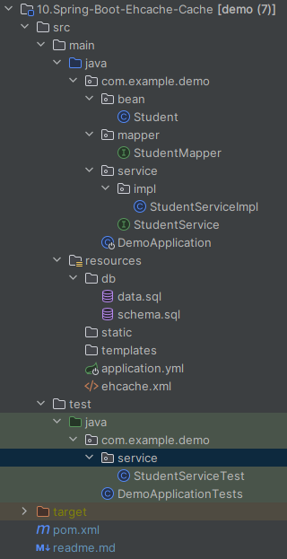

# Spring Boot中使用Ehcache缓存

在[Spring Boot中使用Redis缓存数据](../09.Spring-Boot-Redis-Cache/readme.md)项目【准备工作】和【使用缓存】基础上，改为Ehcache缓存实现。引入Ehcache依赖：

```xml
<dependency>
    <groupId>org.ehcache</groupId>
    <artifactId>ehcache</artifactId>
    <version>3.9.9</version>
</dependency>
```

新建 `src/main/resources/ehcache.xml`  ：

```xml
<config xmlns='http://www.ehcache.org/v3'
        xmlns:xsi="http://www.w3.org/2001/XMLSchema-instance"
        xsi:schemaLocation="http://www.ehcache.org/v3 http://www.ehcache.org/schema/ehcache-core-3.0.xsd">

    <cache-template name="default-template">
        <expiry>
            <ttl unit="minutes">10</ttl>
        </expiry>
        <resources>
            <heap unit="entries">1000</heap>
            <offheap unit="MB">100</offheap>
        </resources>
    </cache-template>

    <cache alias="student" uses-template="default-template">
    </cache>
</config>
```

最终项目目录如下所示：



这样就可以开始使用ehcache了，运行测试方法`src/test/java/com/example/demo/service/StudentServiceTest.java#queryBySno`，观察控制台：

```
2024-05-05T07:08:51.877+08:00 DEBUG 11204 --- [           main] c.e.d.mapper.StudentMapper.queryBySno    : ==>  Preparing: select * from student where sno=?
2024-05-05T07:08:51.919+08:00 DEBUG 11204 --- [           main] c.e.d.mapper.StudentMapper.queryBySno    : ==> Parameters: 001(String)
2024-05-05T07:08:51.957+08:00 DEBUG 11204 --- [           main] c.e.d.mapper.StudentMapper.queryBySno    : <==      Total: 1
Student(sno=001, name=KangKang, sex=M)
Student(sno=001, name=KangKang, sex=M)
```

可看到第二次是从缓存中获取的。

测试更新`src/test/java/com/example/demo/service/StudentServiceTest.java#update`：

```
2024-05-05T07:10:05.695+08:00 DEBUG 14192 --- [           main] c.e.d.mapper.StudentMapper.queryBySno    : ==>  Preparing: select * from student where sno=?
2024-05-05T07:10:05.738+08:00 DEBUG 14192 --- [           main] c.e.d.mapper.StudentMapper.queryBySno    : ==> Parameters: 001(String)
2024-05-05T07:10:05.777+08:00 DEBUG 14192 --- [           main] c.e.d.mapper.StudentMapper.queryBySno    : <==      Total: 1
Student(sno=001, name=KangKang, sex=M)
2024-05-05T07:10:05.781+08:00 DEBUG 14192 --- [           main] c.e.demo.mapper.StudentMapper.update     : ==>  Preparing: update student set sname=?,ssex=? where sno=?
2024-05-05T07:10:05.785+08:00 DEBUG 14192 --- [           main] c.e.demo.mapper.StudentMapper.update     : ==> Parameters: 康康(String), M(String), 001(String)
2024-05-05T07:10:05.787+08:00 DEBUG 14192 --- [           main] c.e.demo.mapper.StudentMapper.update     : <==    Updates: 1
2024-05-05T07:10:05.787+08:00 DEBUG 14192 --- [           main] c.e.d.mapper.StudentMapper.queryBySno    : ==>  Preparing: select * from student where sno=?
2024-05-05T07:10:05.788+08:00 DEBUG 14192 --- [           main] c.e.d.mapper.StudentMapper.queryBySno    : ==> Parameters: 001(String)
2024-05-05T07:10:05.788+08:00 DEBUG 14192 --- [           main] c.e.d.mapper.StudentMapper.queryBySno    : <==      Total: 1
更新完毕
Student(sno=001, name=康康, sex=M)
```

第二次查询也是从缓存中获取的。

